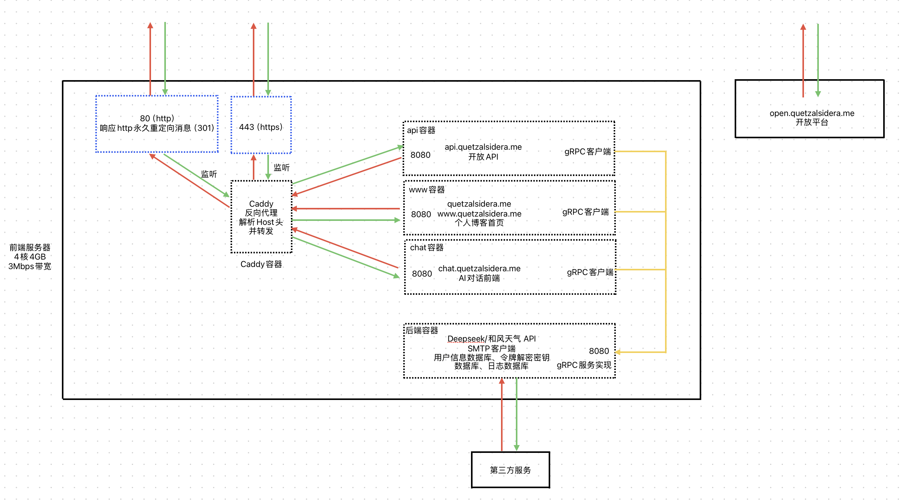

<div align="center">


# QuetzalSidera.Me

_Full-Stack Web Project Based On Blazor And ASP.NET_

> 此间是梦之隙，蔚蓝的诗篇于此停驻。
</div>
<p align="center">

  
  
  
  
  
</p>


---

> **项目地址**：[www.quetzalsidera.me](https://www.quetzalsidera.me) ｜ [chat.quetzalsidera.me](https://chat.quetzalsidera.me) ｜ [api.quetzalsidera.me](https://api.quetzalsidera.me) <br/>
> **开放平台**： [open.quetzalsidera.me](https://open.quetzalsidera.me)<br/>
> **说明：** 源代码中所有敏感数据均已脱敏。

---

## 🏗️ 项目概述

本项目是域名[www.quetzalsidera.me](https://www.quetzalsidera.me), [chat.quetzalsidera.me](https://chat.quetzalsidera.me), [api.quetzalsidera.me](https://api.quetzalsidera.me)的前后端源代码<br/>
开放平台[open.quetzalsidera.me](https://open.quetzalsidera.me)为github托管的静态网页，参见<a href="https://github.com/QuetzalSidera/quetzalsidera.github.io">源代码</a>

**源代码结构**

QuetzalSidera.Me/ → 主站（个人博客）前端<br/>
Chat.QuetzalSidera.Me/ → 聊天前端（AI 聊天）<br/>
Api.QuetzalSidera.Me/ → RESTful API 前端<br/>
Grpc/ → gRPC 通信模块<br/>
Backend/ → 统一后端

**项目示意图**


**技术栈**

- **前端**：ASP.NET Core Blazor · HTML/CSS · RESTful API · gRPC · Caddy（反向代理）
- **后端**：EF Core · SQLite · gRPC · SMTP
- **部署**：Docker（全容器化部署）

**安全与架构**

- 全站启用 **HTTPS**，证书由 **Caddy + ZeroSSL** 自动化管理。
- 部署仅开放 **80 / 443** 端口，其余端口仅在容器内部可见。
- 所有组件均使用 原生 Blazor + HTML/CSS/C# 构建，**无任何第三方UI框架/组件库依赖**。

---

## ⚙️ 架构设计理念

传统 Blazor 项目前后端是不分离的，而 **QuetzalSidera.Me** 采用 **前后端分离 + gRPC 通信** 模式，出于以下考虑：

- **前后端分离部署**：前端可在公网服务器运行，不需要公网IP的第三方服务部署在位于内网的后端，通过 **Frp** 穿透通信。
- **带宽优化**：例如邮件验证码发送由后端完成，避免每次传输完整 HTML 内容。
- **数据隔离**：AI 聊天上下文由后端维护，前端仅传输新消息，降低请求体大小。
- **统一后端服务**：
    - 在 `chat.quetzalsidera.me` 注册的账号可用于 API 访问。
    - <code>api.quetzalsidera.me</code>可实时查询或修改<code>www.quetzalsidera.me</code>内容，实现互通。
- **P.S.**：最开始是计划做 **物理意义** 上的前后端分离的，前端位于公网服务器上，后端位于校园网内，但最后考虑到校园网环境并不稳定（~~有稳定过吗~~），因此将后端项目同样部署于同一个云服务器上，通过容器网络通信。

---

## 🔗 gRPC v.s. RESTful ：

api.quetzalsidera.me开放API使用RESTful风格:

- 简单易用，易于编写API文档
- 接口清晰，维护成本低。

后端->前端通信使用gRPC:

- 支持 **服务端流式输出**，便于 AI 回复实时传输。
- 序列化高效，数据包更小。
- `.proto` 文件可同时生成 **客户端与服务端接口**，开发成本低。

---

### 🐳 容器化部署

- **多阶段构建**：构建镜像与运行镜像分离，减少体积。
- **卷挂载隔离**：用户数据 / 密钥文件 / 运行日志分卷存储，安全可控（~~日志多了方便直接删日志库~~）。

```dockerfile 
#compose.yaml
volumes:
  #数据卷
  chat_data:
  www_data:
  api_data:
  #日志卷
  log_data:
  www_log_data:
  chat_log_data:
  api_log_data:
  #密钥卷
  www_key_data:
  chat_key_data:
  api_key_data:
 #Caddy卷
  caddy_data:
  caddy_logs:
```

- **最小暴露面**：仅反向代理容器映射物理端口，防止多余端口暴露。

```dockerfile
   #Caddy反向代理
  caddy:
   #...
    ports:
      - "80:80"
      - "443:443"
    networks:
      - front-network
   #...
```

---

## 📝 子项目说明

### 🌐 [www.quetzalsidera.me](https://www.quetzalsidera.me)

个人博客前端，为了搜索引擎优化而采用了服务端渲染，数据均来自后端数据库，并在前端内存中进行缓存（大部分内容缓存1小时，天气组件缓存30分钟），可通过
API 动态修改内容。


---

### 💬 [chat.quetzalsidera.me](https://chat.quetzalsidera.me)

网页端 AI 聊天项目，AI 角色为《蔚蓝档案》千禧年科技学院游戏开发部机器人 **爱丽丝** (爱丽丝可爱喵~)。  
提示词请参见文件：`Backend/ThirdParty/Assistant/AgentPrompt.cs`

**1.用户数据如何进行同步**<br/>
网页端首次渲染时，会从浏览器LocalStorage中读取加密的令牌信息，并使用服务端的密钥进行解密，通过令牌信息从后端同步历史对话记录。
为减少不必要的轮询，网页只会在“页面第一次渲染”或“登录成功”后从数据库获取历史记录，若您的同一账号在别的地方有未同步的历史记录，请
**刷新页面** 以同步

- 浏览器 LocalStorage 中保存加密令牌，服务端解密后同步历史对话。

```csharp
var userGuid = await ProtectedLocalStorage.GetAsync<string>(AppState.UserGuidKey);
var authToken = await ProtectedLocalStorage.GetAsync<string>(AppState.AuthTokenKey);
var createTimestamp = await ProtectedLocalStorage.GetAsync<long>(AppState.CreateTimestampKey);
//...
await ChatService.GetUserInfoAsync();
await ChatService.SyncChatHistoryAsync();
```

- 无令牌或令牌无效时自动申请临时令牌并存储到LocalStorage（临时令牌对应的会话记录在12小时内无更新访问记录即清除）。

``` csharp
await ChatService.GetTempUserAsync();
try
{
    await ProtectedLocalStorage.SetAsync(AppState.AuthTokenKey, ChatService.AuthToken.CookieString);
    await ProtectedLocalStorage.SetAsync(AppState.UserGuidKey, ChatService.AuthToken.UserGuid);
    await ProtectedLocalStorage.SetAsync(AppState.CreateTimestampKey, ChatService.AuthToken.CreateTimestamp);
}
catch
{
    //...
}
```

- 登录/注册后临时令牌的会话记录自动合并至正式账户。

```csharp
public async Task<List<ChatSessionModel>> SyncChatHistoryAsync()
{
    //...
    //非游客账户且本地记录条数不为0
    if (AuthToken.IsRegistered && LocalHistory.History.Count != 0)
    {
        LocalHistory.UserGuid = AuthToken.UserGuid;
        //合并记录到后端
        await chatSessionService.MergeHistoryAsync(LocalHistory);
    }
    //...
}
```

**2.用户数据安全如何保障**

- 全站 HTTPS + AntiForgery
  Cookie防御CSRF/XSRF攻击,以下为源代码中部分内容，更多请参见<a href="https://learn.microsoft.com/zh-cn/aspnet/core/security/anti-request-forgery?view=aspnetcore-9.0">
  微软官方文档</a>。

```csharp
 // 持久化密钥到指定路径
 builder.Services.AddDataProtection()
     .PersistKeysToFileSystem(new DirectoryInfo(path)) 
     .SetApplicationName("Chat.QuetzalSidera.Me"); 
//...
  app.UseAntiforgery();
```

- 单次会话期间的用户身份鉴别由Blazor框架自动处理，用户长期令牌加密存储于 LocalStorage，密钥仅存在于服务端,
  参见<a href="https://learn.microsoft.com/en-us/dotnet/api/microsoft.aspnetcore.components.server.protectedbrowserstorage.protectedlocalstorage?view=aspnetcore-9.0">
  微软官方文档</a>。
- 所有输入输出均进行 HTML 编码防止 XSS,
  此部分由Blazor框架自动处理，参见<a href="https://learn.microsoft.com/zh-cn/aspnet/core/security/cross-site-scripting?view=aspnetcore-9.0">
  微软官方文档</a>。
- 密码采用 **PBKDF2 + 盐** 单向加密存储。

```csharp
 public static string HashPassword(string plainPassword)
 {
    // 生成随机盐
    byte[] salt = GenerateRandomSalt();
    // 使用 PBKDF2 进行哈希
    byte[] hash = Pbkdf2(plainPassword, salt, Iterations, HashSize);
    // 格式：算法$迭代次数$盐$哈希值（全部使用Base64）
    return $"{AlgorithmIdentifier}{Delimiter}{Iterations}{Delimiter}{Convert.ToBase64String(salt)}{Delimiter}{Convert.ToBase64String(hash)}";
 }
```

- 数据库仅对容器网络开放访问。

**3.用户数据完整性如何保障**<br/>
数据库为每位用户的历史记录分配了同步锁对象， 避免针对同一个账户的并发操作（如多终端登录）导致用户数据不一致

```csharp
 public static bool UpdateSession(AuthTokenModel authTokenModel, string sessionGuid, List<ChatMessageModel> messages,
        string? title = null)
    {
        if (!HistoryLocks.ContainsKey(authTokenModel.UserGuid))
            HistoryLocks.TryAdd(authTokenModel.UserGuid, new Lock());
        lock (HistoryLocks[authTokenModel.UserGuid])
        {
           //数据库操作...
        }
    }
```

并且数据入库将在AI流式回复结束后进行，避免阻塞AI回复线程

```csharp
 public override async Task PostMessage(ChatMessagePostInfo request, IServerStreamWriter<ChatMessage> responseStream,
        ServerCallContext context){
     //... 
     //流式回复
     await foreach (string responsePiece in deepsSeekClient.SendMessageAsync(messages))
                {
                    //...
                    await responseStream.WriteAsync(new ChatMessageModel()
                    {
                        MessageGuid = responseGuid,
                        Timestamp = responseTimestamp,
                        Talker = Talker.Agent,
                        Message = responsePiece,
                    });
                }

  //回复结束，将记录插入数据库
   DatabaseHelper.UpdateSession(authToken, session.SessionGuid, [message, response], title);
  }
```

**4.流式输出实现**<br/>
在每轮对话中，AI的回复是实时生成的(流式)，而不是在回复生成结束后才被整体发送给用户(非流式)
。由于第三方API请求均由后端发起，流式输出意味着从第三方服务器->后端->前端->用户页面的全链条都必须是流式的

- **第三方服务器->后端**: DeepSeek API 提供流式输出。

```csharp
public async IAsyncEnumerable<string> SendMessageAsync(List<ChatMessageModel> messages)
{
    var client = new DeepSeek.Core.DeepSeekClient(ApiKey);
    //...
    var choices = client.ChatStreamAsync(request, CancellationToken.None);
    await foreach (var response in choices)
    {
        yield return response.Delta?.Content ?? string.Empty;
    } 
}
```

- **后端->前端**: 后端使用 gRPC 服务端流式传输至前端。

```csharp
public override async Task PostMessage(ChatMessagePostInfo request, IServerStreamWriter<ChatMessage> responseStream,
        ServerCallContext context)
{
    //... 
    await foreach (string responsePiece in deepsSeekClient.SendMessageAsync(messages))
    {
        //...
        await responseStream.WriteAsync(new ChatMessageModel()
        {
            MessageGuid = responseGuid,
            Timestamp = responseTimestamp,
            Talker = Talker.Agent,
            Message = responsePiece,
        });
    } 
    //...
}
```

- **前端->用户页面**: 前端通过 Blazor 差异化渲染AI回复气泡实现实时显示。

```csharp
//流式输出
 private async Task SendMessage(){ 
    //...
    await foreach (var response in responses)
    {
        messageModel.Message += response.Message;
        //调用StateHasChanged触发组件重新渲染
        StateHasChanged();
    }
}
```

---

### 🔐 [api.quetzalsidera.me](https://api.quetzalsidera.me)

开放 RESTful API，在[chat.quetzalsidera.me](https://chat.quetzalsidera.me)注册的用户可申请 API Token。  <br/>
更多内容参见[开放API文档](https://open.quetzalsidera.me/doc)

---

## 🧩 项目亮点

- 💡 原生 Blazor 前端动画
- 🧱 纯容器化部署
- 🔐 全站HTTPS 自动证书 + 全站 AntiForgery Cookie + 加密LocalStorage持久化令牌
- 🧮 数据库并发安全设计
- 🌐 前端多语言支持
- 🧠 DeepSeek API流式输出
- 🔒 完整ICP备案 + 联网备案 + 安全评估

---
如果你喜欢这个项目，点一个star吧~
